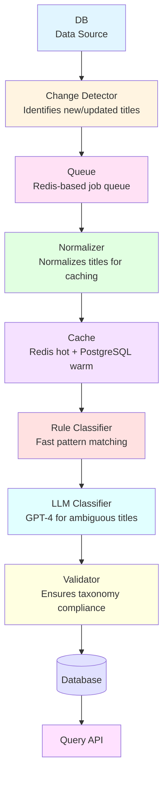

# System Architecture

## Overview

The Job Title Standardization Pipeline uses a hybrid rule-based + LLM approach to efficiently classify job titles into standardized Department, Function, and Seniority fields. The architecture is designed for scalability, cost-effectiveness, and extensibility.

## Architecture Diagram

## Component Descriptions

### Data Source
The source database containing job titles that need to be standardized. This component serves as the entry point for the standardization pipeline, providing the raw job title data that will be processed.

**Tables**:
- `member.title` - Current job titles
- `member_experience.title` - Historical job titles

### Change Detector
Identifies new or updated job titles in the source database. This component monitors the data source for changes and triggers the standardization process for titles that require processing.

**Responsibilities**:
- Detect new member profiles
- Detect job title changes
- Queue titles for processing

### Queue
A Redis-based job queue that manages the asynchronous processing of job titles. It decouples the change detection from the processing pipeline, allowing for scalable and resilient title standardization workflows.

**Technology**: Redis Queue (RQ) or Celery

### Normalizer
Normalizes job titles for caching purposes. This component standardizes the format, case, and structure of titles before they enter the caching layer, ensuring consistent cache key generation and lookup.

**Operations**:
- Lowercase conversion
- Whitespace normalization
- Special character handling
- Hash generation for cache keys

### Cache
A two-tier caching system consisting of Redis for hot data (frequently accessed, fast retrieval) and PostgreSQL for warm data (less frequently accessed, persistent storage). This hybrid approach optimizes both performance and cost.

**Strategy**:
- **Redis (Hot)**: Frequently accessed titles, TTL-based eviction
- **PostgreSQL (Warm)**: Persistent cache table, long-term storage
- **Target Hit Rate**: 90%+

### Rule Classifier
Performs fast pattern matching on job titles using predefined rules. This component handles straightforward title classifications efficiently, providing quick results for titles that match known patterns.

**Characteristics**:
- Speed: ~0.1ms per title
- Coverage: ~40% of titles
- Cost: $0 (no API calls)
- Confidence threshold: ≥0.7

### LLM Classifier
Uses GPT-4 to classify ambiguous job titles that cannot be handled by the rule-based classifier. This component leverages large language model capabilities to understand context and nuances in job titles that require intelligent interpretation.

**Characteristics**:
- Speed: ~100-500ms per batch (50-200 titles)
- Coverage: Handles remaining ~60% of titles
- Cost: ~$0.001 per title (with batching and caching)
- Batch size: 50-200 titles per API call

### Validator
Ensures that all standardized job titles comply with the defined taxonomy. This component performs final validation checks to guarantee that the output meets quality standards and taxonomy requirements before storage.

**Validation Rules**:
- Department must be in taxonomy
- Function must belong to department
- Seniority must be valid level
- Confidence score validation

### Database
The final destination database where standardized job titles are stored. This persistent storage maintains the processed and validated results for downstream consumption.

**Schema**:
- Standardized fields added to `member` and `member_experience` tables
- Cache table for storing classification results
- Lookup tables for taxonomy

### Query API
Provides a REST API interface for querying standardized job titles. This component exposes SQL views and API endpoints that allow applications and services to retrieve standardized title data.

**Endpoints**:
- `GET /api/v1/people?department=Sales&seniority=Senior`
- `POST /api/v1/standardize`

## Processing Flow

### Single Title Classification

1. **Normalize**: Clean title, generate hash
2. **Check Cache**: Redis → PostgreSQL cache table → Rules
3. **Rule Classify**: Pattern matching (if cache miss)
4. **LLM Classify**: Batch API call (if rule confidence < 0.7)
5. **Validate**: Ensure taxonomy compliance
6. **Save**: Cache + Update member/member_experience tables

### Batch Processing

1. **Deduplicate**: Find unique titles
2. **Classify Unique**: Process each unique title once
3. **Propagate**: Update all records with same title

## Cost Optimization Strategy

### Caching
- **Target**: 90%+ cache hit rate
- **Layers**: Redis (hot) + PostgreSQL (warm) + Rules (built-in)
- **Impact**: Reduces LLM API calls by 90%+

### Batching
- **Batch Size**: 50-200 titles per LLM call
- **Impact**: 80-90% cost reduction vs individual calls
- **Trade-off**: Slight latency increase

### Deduplication
- **Strategy**: Process unique titles only
- **Impact**: 90% reduction in processing volume
- **Example**: 1M titles → ~100K unique titles

### Model Selection
- **Rule-based**: Free, handles common cases
- **GPT-3.5**: Lower cost for simple cases
- **GPT-4**: Higher cost, better accuracy for ambiguous cases

## Performance Targets

| Metric | Target |
|--------|--------|
| Cache Hit Rate | 90%+ |
| Processing Throughput | 1000+ titles/hour |
| Classification Accuracy | 90%+ |
| Cost per Title | <$0.001 |
| API Latency (p95) | <500ms |

## Scalability Considerations

### Horizontal Scaling
- **Workers**: Multiple worker processes for parallel processing
- **Queue**: Redis queue supports distributed workers
- **API**: Stateless API servers can scale horizontally

### Database Scaling
- **Read Replicas**: For query API
- **Partitioning**: Cache table by hash prefix
- **Indexing**: Optimized indexes for common queries

### Caching Strategy
- **Redis Cluster**: For high availability
- **Cache Warming**: Pre-populate common titles
- **TTL Strategy**: Balance freshness vs hit rate

## Technology Stack

| Component | Technology |
|-----------|-----------|
| Language | Python 3.11+ |
| Database | PostgreSQL 15+ |
| Cache | Redis 7+ |
| Queue | RQ or Celery |
| API | FastAPI |
| LLM | OpenAI GPT-4 Turbo |
| Testing | pytest |

## Error Handling

### Retry Strategy
- **Transient failures**: 3 retries with exponential backoff
- **Validation failures**: Automatic repair attempt
- **Persistent failures**: Dead letter queue

### Idempotency
- **Key**: (source_type, source_id)
- **Prevents**: Duplicate processing
- **Ensures**: Consistent results

## Monitoring

### Key Metrics
- Cache hit rate
- LLM API calls and cost
- Processing throughput (titles/hour)
- Error rate by type
- Queue depth

### Tools
- Prometheus for metrics
- Grafana for dashboards
- Structured logging (JSON)

## Deployment

### Development
- Docker Compose (PostgreSQL + Redis + API + Worker)

### Production
- Kubernetes (API: 2-3 replicas, Workers: 5-10 replicas)
- Managed PostgreSQL (RDS/Cloud SQL)
- Managed Redis (ElastiCache/Memorystore)

## Future Extensions

The architecture is designed to support additional standardization pipelines:

1. **Education Major Standardization**
2. **Age Estimation**
3. **Startup Flag Detection**
4. **Skill Extraction**
5. **Experience Duration Calculation**

Each pipeline can follow the same pattern: Normalizer → Cache → Classifier → Validator → Database
